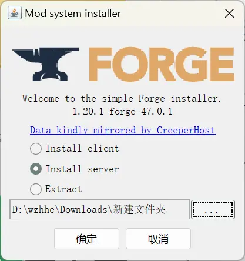
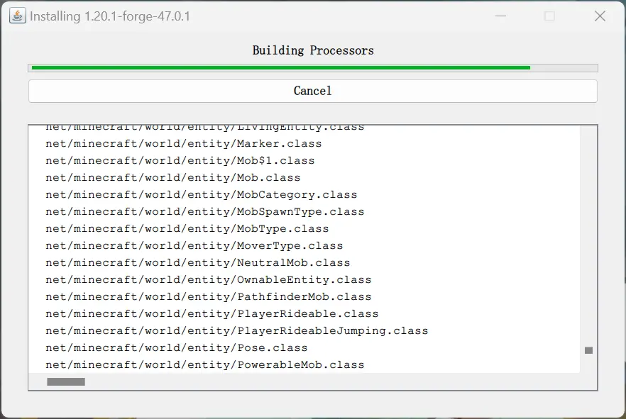

+++
title = 'Minecraft搭建本地服务器'
date = '2022-12-13T22:31:54+08:00'
tags = ['Minecraft','我的世界','FRP','内网穿透']
categories = ['教程']
image= 'https://th.bing.com/th/id/R.70d270fd1f6b92f71d8270139739452f?rik=iZaoU4fUsfs4dw&riu=http%3a%2f%2fgamesminecraft.org%2fgames%2fimg%2fminecraft-inspiration_2676x1505.jpg&ehk=yFg%2fq8SlDV1%2bFASrbAb93%2b%2fIFYJyOe9FhDaTQv5nhBU%3d&risl=&pid=ImgRaw&r=0'
+++


## Java
 - Java 17(1.17及以上版本)
[https://www.oracle.com/java/technologies/downloads/](https://www.oracle.com/java/technologies/downloads/)

 - Java 8(1.17以下版本)
[https://www.java.com/en/download/](https://www.java.com/zh-CN/download/)

---

## 原版
 - server.jar   [https://mcversions.net/](https://mcversions.net/)
在`Stable Releases`栏选择需要的版本点击`Download`，选择`Download Server Jar`

下载完成后将`server.jar`文件放在一个文件夹里，右键文件夹空白区域选择`在终端中打开`(Win10可能需要按住Shift点击右键)。
在终端中运行以下命令：
```powershell
java -Xms1024M -Xmx1024M -jar server.jar nogui
```
此时会在文件夹中生成一些文件，并显示提示：
```powershell
You need to agree to the EULA in order to run the server. Go to eula.txt for more info.
```
回到文件夹打开`eula.txt`，将`false`改为`true`:
```
eula=true
```
此时再回到终端运行这条命令：
```powershell
java -Xms1024M -Xmx1024M -jar server.jar nogui
```
Windows防火墙可能会有提示，允许即可。
当终端显示下面这行时说明服务器开启成功：
```powershell
Done (30.927s)! For help, type "help"
```
在终端中向上找，找到这一行：
```powershell
Starting Minecraft server on *:25565
```
其中冒号后面的数字就是你服务器运行的端口(可能会不一样)，此时服务器运行在：
```powershell
127.0.0.1:25565
```

现在你本地打开一个Minecraft客户端(不要关闭终端)，就是平时自己玩的那个。进游戏点击多人游戏，选择添加服务器，服务器名随意，服务器地址填上面那个地址。
此时是进不去服务器的，还要打开文件夹中的`server.properties`文件，修改以下选项：
```
online-mode=false
```
> 这个选项开启之后会验证正版账号，也就是说开启之后只有正版才能进去，所以需要关闭。其他选项的意思参考[Minecraft Wiki](https://minecraft.fandom.com/zh/wiki/Server.properties#Minecraft%E6%9C%8D%E5%8A%A1%E5%99%A8%E5%B1%9E%E6%80%A7)

此时在终端输入`stop`关闭服务器(之后关闭服务器都这么关，这样它会保存你的存档)，再运行启动服务器的命令：
```
java -Xms1024M -Xmx1024M -jar server.jar nogui
```
这时客户端就能进服务器了🎉，但此时服务端还只是运行在你自己的电脑上，只有你自己和局域网内的电脑可以连接，接下来就是将本地端口共享给其他人。

---

## Fabric版

### 从原版安装
1. 到[Fabric官网](https://fabricmc.net/use)下载最新安装器，点击中间的`Download for Windows`
2. 双击打开下载的文件，选择`服务端`，选择**正确的游戏版本**，加载器版本默认最新即可，安装位置选择原版服务器路径，点击安装，安装完成后可以关闭安装界面。
3. 此时服务器的启动指令变为：
```
java -Xms1024M -Xmx1024M -jar fabric-server-launch.jar nogui
```
### 直接安装
[下载](https://fabricmc.net/use/server/)对应版本的jar文件，放到空文件夹中，并在该路径下在终端中运行：
```
java -Xmx2G -jar 下载的文件名 nogui
```
同样需要调整`eula.txt`和`server.properties`文件。

---

## Forge版
1. 在[官网](https://files.minecraftforge.net/net/minecraftforge/forge/)下载正确版本的jar文件
2. 双击运行，选择`Insall server`并选择一个空文件夹，点击确定


3. 安装完成后目录：
```
folder/
├── libraries
├── run.bat
├── run.sh
├── user_jvm_args.txt
```
4. 双击运行`run.bat`即可，如果想要只弹出命令行窗口的话，可以用记事本打开`run.bat`，并在java开头那一行最后添加`空格nogui`
```bash
java @user_jvm_args.txt @libraries/net/minecraftforge/forge/1.20.1-47.0.1/win_args.txt %* nogui
```

---

## 内网穿透
各种内网穿透工具官网都有详细的使用说明。
 - OPENFRP 官网：[www.openfrp.net](https://www.openfrp.net/)
 - OPENFRP 使用方法：[docs.openfrp.net](https://docs.openfrp.net/)

---

参考文章：
[Minecraft Wiki/教程/架设服务器](https://minecraft.fandom.com/zh/wiki/%E6%95%99%E7%A8%8B/%E6%9E%B6%E8%AE%BE%E6%9C%8D%E5%8A%A1%E5%99%A8)
