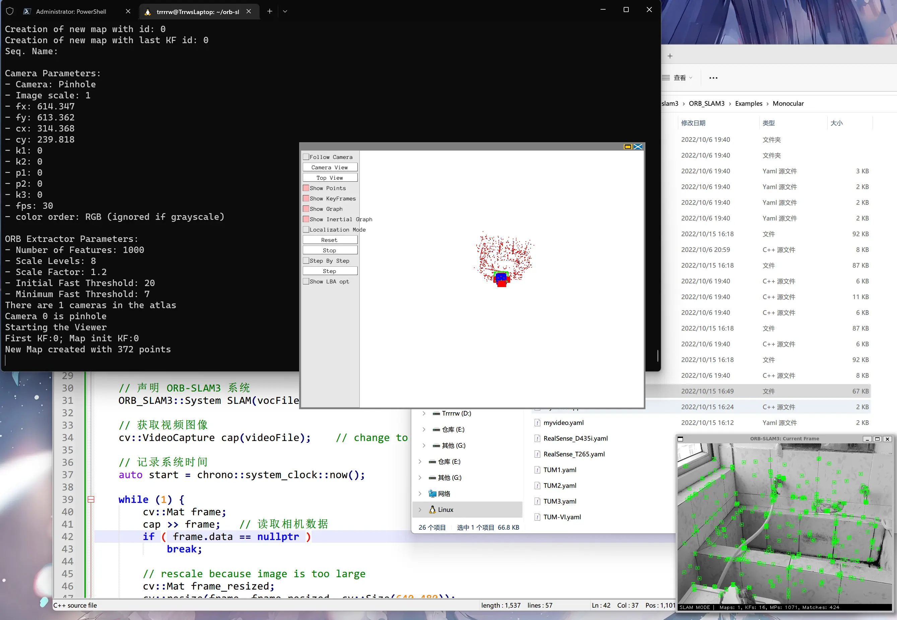

+++
title = 'ORB SLAM3运行自己的数据集'
date = '2022-10-15T15:45:57+08:00'
tags = ['ORB-SLAM3','WSL2','Ubuntu']
categories = ['教程']
image= 'ORB-SLAM3-cover.webp'
+++


## 准备
1. 在`ORB_SLAM3\Examples\Monocular`下新建`myvideo.yaml`和`myvideo.cpp`，视频文件也放到这。
2. 在`myvideo.yaml`中添加内容：
```yaml
%YAML:1.0

#--------------------------------------------------------------------------------------------
# Camera Parameters. Adjust them!
#--------------------------------------------------------------------------------------------
Camera.type: "PinHole"

# Camera calibration and distortion parameters (OpenCV) 
Camera.fx: 614.3472290039062
Camera.fy: 613.3615112304688
Camera.cx: 314.36767578125
Camera.cy: 239.8182830810547

Camera.k1: 0.0
Camera.k2: 0.0
Camera.p1: 0.0
Camera.p2: 0.0
Camera.k3: 0.0

# Camera frames per second 
Camera.fps: 30.0

# Color order of the images (0: BGR, 1: RGB. It is ignored if images are grayscale)
Camera.RGB: 1

# Camera resolution
Camera.width: 1920
Camera.height: 1080

#--------------------------------------------------------------------------------------------
# ORB Parameters
#--------------------------------------------------------------------------------------------

# ORB Extractor: Number of features per image
ORBextractor.nFeatures: 1000

# ORB Extractor: Scale factor between levels in the scale pyramid 	
ORBextractor.scaleFactor: 1.2

# ORB Extractor: Number of levels in the scale pyramid	
ORBextractor.nLevels: 8

# ORB Extractor: Fast threshold
# Image is divided in a grid. At each cell FAST are extracted imposing a minimum response.
# Firstly we impose iniThFAST. If no corners are detected we impose a lower value minThFAST
# You can lower these values if your images have low contrast			
ORBextractor.iniThFAST: 20
ORBextractor.minThFAST: 7

#--------------------------------------------------------------------------------------------
# Viewer Parameters
#--------------------------------------------------------------------------------------------
Viewer.KeyFrameSize: 0.05
Viewer.KeyFrameLineWidth: 5
Viewer.GraphLineWidth: 0.9
Viewer.PointSize:2
Viewer.CameraSize: 0.08
Viewer.CameraLineWidth: 3
Viewer.ViewpointX: 0
Viewer.ViewpointY: -0.7
Viewer.ViewpointZ: -1.8
Viewer.ViewpointF: 500
```
3. 在`myvideo.cpp`中添加内容：
```cpp
//
// Created by xiang on 11/29/17.
//

// 该文件将打开给定的视频文件，并将图像传递给ORB-SLAM2进行定位

// 需要opencv
#include <opencv2/opencv.hpp>

// ORB-SLAM的系统接口
#include "System.h"

#include <string>
#include <chrono>   // for time stamp
#include <iostream>

using namespace std;

// 参数文件与字典文件
// 如果你系统上的路径不同，请修改它
// 第二个路径建议用相对路径
string parameterFile = "./myvideo.yaml";
string vocFile = "../../Vocabulary/ORBvoc.txt";

// 视频文件，修改的话需要和你的视频名字一起改
string videoFile = "./video.mp4";

int main(int argc, char **argv) {

    // 声明 ORB-SLAM3 系统
    ORB_SLAM3::System SLAM(vocFile, parameterFile, ORB_SLAM3::System::MONOCULAR, true);

    // 获取视频图像
    cv::VideoCapture cap(videoFile);    // change to 1 if you want to use USB camera.

    // 记录系统时间
    auto start = chrono::system_clock::now();

    while (1) {
        cv::Mat frame;
        cap >> frame;   // 读取相机数据
        if ( frame.data == nullptr )
            break;

        // rescale because image is too large
        cv::Mat frame_resized;
        cv::resize(frame, frame_resized, cv::Size(640,480));

        auto now = chrono::system_clock::now();
        auto timestamp = chrono::duration_cast<chrono::milliseconds>(now - start);
        SLAM.TrackMonocular(frame_resized, double(timestamp.count())/1000.0);
        cv::waitKey(30);
    }

    SLAM.Shutdown();
    return 0;
}
```
4. 修改ORB_SLAM3的`CMakeLists.txt`，在最后添加：
```cmake
add_executable(myvideo Examples/Monocular/myvideo.cpp)
target_link_libraries(myvideo ${PROJECT_NAME})
```

## 运行
运行ORB_SLAM3
```bash
cd ORB_SLAM3
chmod +x build.sh
./build.sh
```
不知道为什么`myvideo`文件生成在了`ORB_SLAM3\Examples_old\Stereo-Inertial`下，复制到`ORB_SLAM3\Examples\Monocular`下就行
之后再运行它：
```bash
cp Examples_old/Stereo-Inertial/myvideo Examples/Monocular/myvideo
./myvideo
```


## 效果


---

参考文章：
[用自己的视频跑ORB_SLAM3](https://www.yuque.com/docs/share/446d5e89-6833-42e7-964d-17c32d98a2cb?#)（密码：eu2t）
