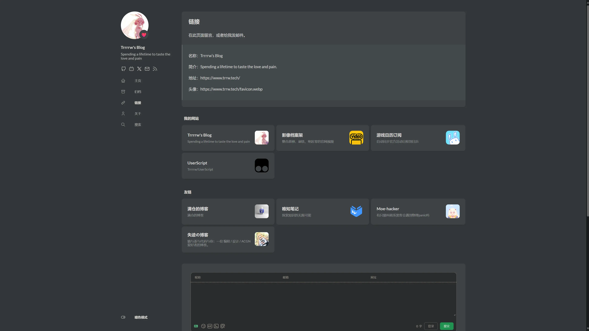

+++
title = 'Stack主题友链页面美化'
date = '2025-06-24T21:05:33+08:00'
tags = ['Stack', 'Hugo']
categories = ['教程']
image = 'cover.webp'
+++

## 前言
Stack默认的友链是一行一个，友链一多就会导致页面很长，影响美观。  
本来是准备参考 *「[建站技术 | 我的链接页面是如何实现的？](./#参考文献)」* 这篇来设置成三列的，但是其HTML文件的内容给的不是很完整，导致完全不熟悉Hugo语法的我没法成功复现，所以就来记录一下。

## 代码
### SCSS
`assets\scss\custom.scss`
```scss
//链接页面
@media (min-width: 1024px) {
    .article-list--compact.links {
        display: grid;
        grid-template-columns: 1fr 1fr 1fr;
        background: none;
        box-shadow: none;

        article {
            background: var(--card-background);
            border: none;
            box-shadow: var(--shadow-l2);
            margin-bottom: 8px;
            border-radius: 10px;

            &:not(:nth-child(3n)) {
                margin-right: 8px;
            }
        }
    }
}

.article-list--title {
    color: var(--accent-color);
    font-weight: 700;
    font-size: 1.6rem;
    margin-left: 10px;
}

.article-list--compact.links {  // 缩小连接组标题与下面链接的距离
    margin-top: -20px;
}

.article-image > img {  // 给文章卡片、友链卡片等的图标添加圆角
    border-radius: 10px;
}
```
这里由于我用不到原博主的 `badge` 功能，所以将那一部分删掉了，并将所有卡片的图标都添加了圆角

### json
`data\links.json`
```json
[
    {
        "title": "我的网站",
        "links": [
            {
                "title": "Trrrrw's Blog",
                "description": "Spending a lifetime to taste the love and pain",
                "website": "https://www.trrw.tech/",
                "image": "https://www.trrw.tech/favicon.webp"
            },
            {
                "title": "影像档案架",
                "description": "整合原神、崩铁、绝区零的官网视频",
                "website": "https://hoyo-video.trrw.tech/",
                "image": "https://hoyo-video.trrw.tech/pwa@1024.png"
            }
        ]
    },
    {
        "title": "友链",
        "links": [
            {
                "title": "唯知笔记",
                "description": "探索知识的无限可能",
                "website": "https://note.weizwz.com",
                "image": "https://p.weizwz.com/logo_a4353391cbf0889b.webp"
            },
            {
                "title": "失迹の博客",
                "description": "猫与茶与代码与你：一位 编程 / 设计 / ACGN 爱好者的博客。",
                "website": "https://blog.reincarnatey.net/",
                "image": "https://npm.elemecdn.com/@mitr-yuzr/vno-dmego-yuzr@latest/assets/img/headimg.png"
            }
        ]
    }
]
```
这里的图片可以是链接，也可以是本地图片，起始路径是 `content\page\links`

### HTML
`layouts\page\links.html`
```html
{{ define "body-class" }}article-page keep-sidebar{{ end }}
{{ define "main" }}
    {{ partial "article/article.html" . }}

    {{ range $i, $category := $.Site.Data.links }}
        <span class="article-list--title">{{ $category.title }}</span>
        <div class="article-list--compact links">
            {{ $siteResources := resources }}
            {{ range $i, $link :=  $category.links }}
                <article>
                    <a href="{{ $link.website }}" target="_blank" rel="noopener">
                        <div class="article-details">
                            <h2 class="article-title">
                                {{- $link.title -}}
                            </h2>
                            <footer class="article-time">
                                {{ with $link.description }}
                                    {{ . }}
                                {{ else }}
                                    {{ $link.website }}
                                {{ end }}
                            </footer>
                        </div>
                        {{ if $link.image }}
                            <div class="article-image">
                                
                            </div>
                        {{ end }}
                    </a>
                </article>
            {{ end }}
        </div>
    {{ end }}

    {{ if not (eq .Params.comments false) }}
        {{ partial "comments/include" . }}
    {{ end }}

    {{ partialCached "footer/footer" . }}

{{ end }}
```
因为我的习惯是直接使用友链网站的图片链接，所以这里把 `` 的 `src` 直接设置成了json中的image参数。

## 最终效果


## 附录
### 参考文献
1. [建站技术 | 我的链接页面是如何实现的？](https://blog.reincarnatey.net/2024/0803-my-links-page/)
2. [Hugo Stack 主题装修笔记 Part 2](https://thirdshire.com/hugo-stack-renovation-part-two/)

### 文章封面
[Skirk](https://www.pixiv.net/artworks/131741703)
