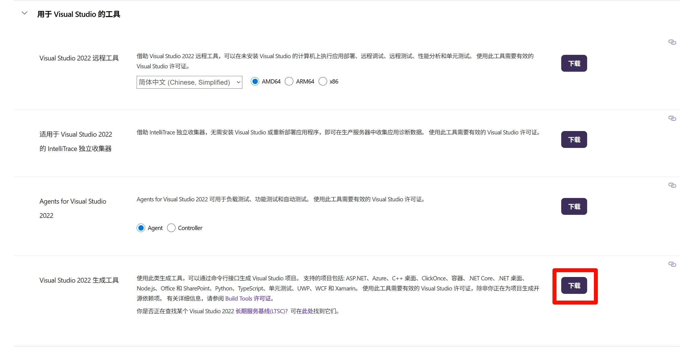
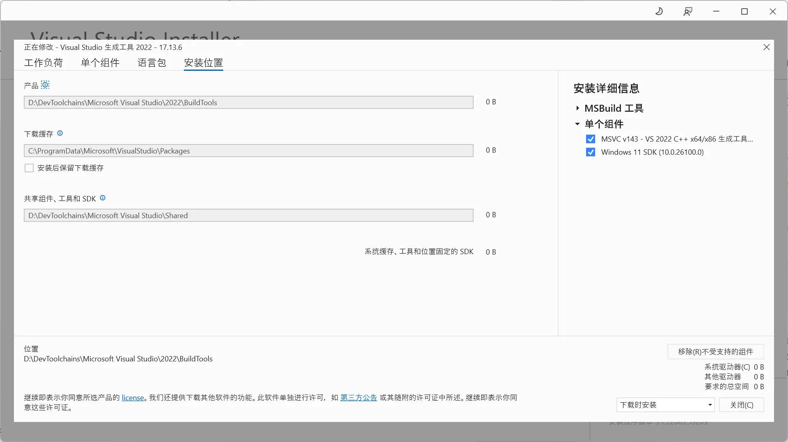
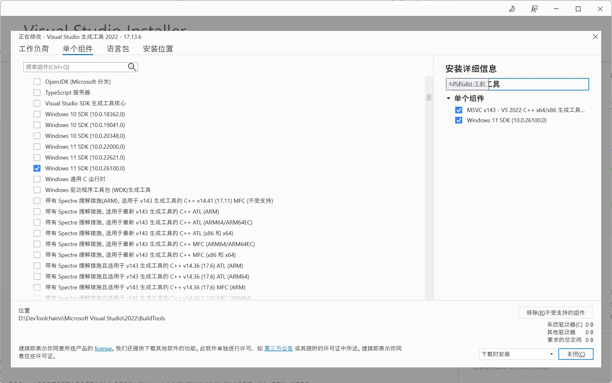
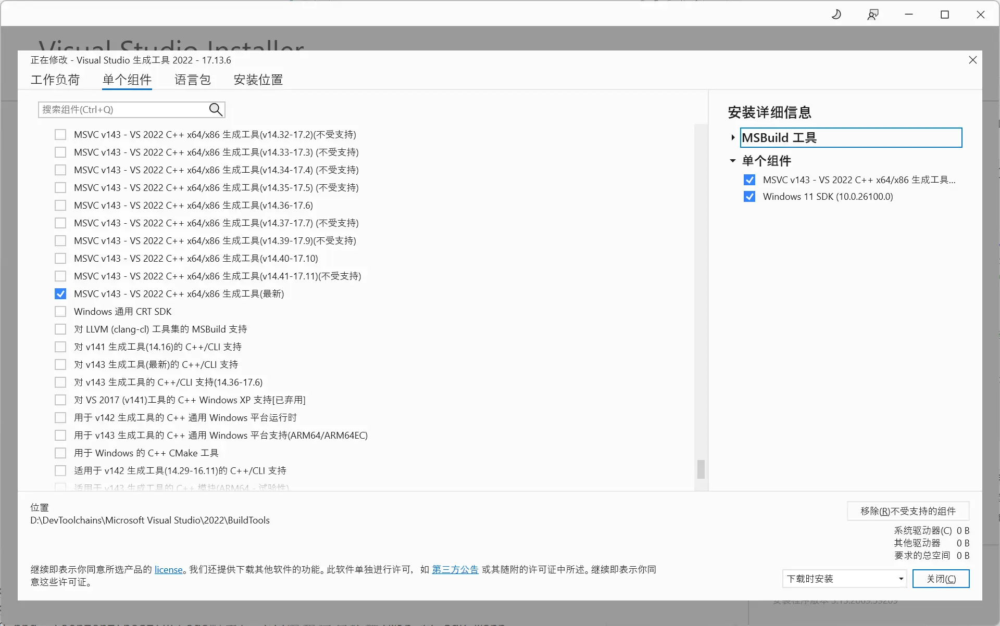
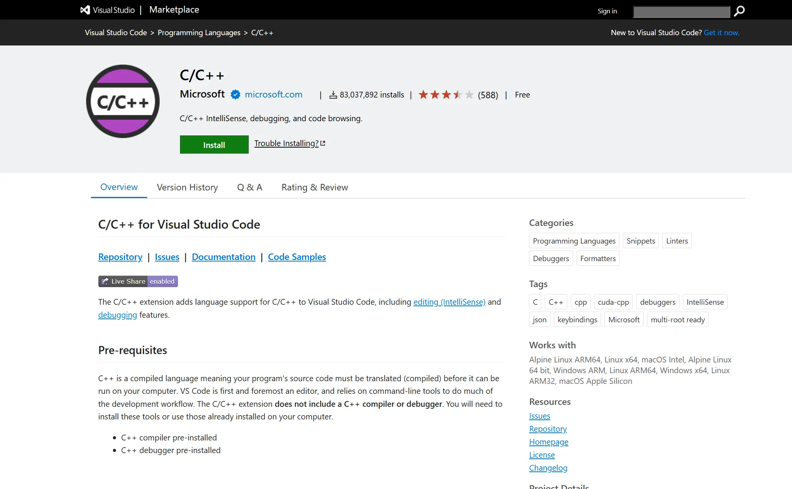
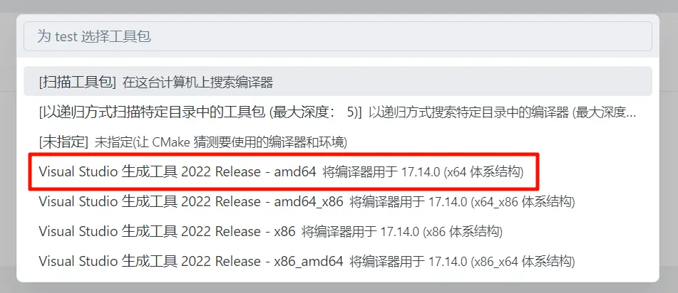

+++
date = '2025-03-16T22:14:12+08:00'
draft = true
title = 'VSCode 配置 C、C++ 编程运行环境'
image = 'cover.webp'
+++

## 前言
前段时间从VSCode换到了字节的Trae，发现超级好用。于是就把Clion和VSCode都卸载了，但是Trae没法安装VSCode的C/C++插件，所以就研究了一下怎么在Trae中使用MSVC+CMake+Clang-Format来写C/C++代码

## MSVC
前往 [Visual Studio 下载页面](https://visualstudio.microsoft.com/zh-hans/downloads/)，不要下载 VS2022，往下翻，在 **用于Visual Studio的工具** 中有个 **Visual Studio 2022 生成工具**，点击右侧的下载



下载完成后安装，在开始菜单中找到 **Visual Studio Installer**，点击打开
可以先在 **安装位置** 处修改 **MSVC** 的安装位置



接着在 **单个组件** 中勾选 **Windows 11 SDK** 和 **MSVC v143 - VS 2022 C++ x64/x86 生成工具(最新)**：





最后点击右下角的安装

## Cmake
见 [Windows11上配置C、C++环境](https://www.trrw.tech/p/windows11%E4%B8%8A%E9%85%8D%E7%BD%AEcc-%E7%8E%AF%E5%A2%83/#cmake)

## Clang-Format
由于Trae使用的是open-vsx的镜像作为市场，其中没有 C/C++ 这个插件



所以想要格式化代码，需要使用 **Clang-Format** 这个插件  
在下载插件前，需要先 [下载 **Clang-Format**](https://llvm.org/builds/)  


~藏的真深🫠~

最后安装 **Clang-Format** 插件


## 新建项目
新建一个文件夹，在其中创建 **CMakeLists.txt** 和 **main.cpp** 文件
```cmake
# CMakeLists.txt

cmake_minimum_required(VERSION 4.0) # 该项目所需的CMake最低版本
project(test)                      # 项目名称

set(CMAKE_CXX_STANDARD 26)         # 使用的C++标准

add_executable(test main.cpp)      # 生成可执行文件: "test.exe"
```

```cpp
// main.cpp

#include <iostream>
using namespace std;

int main() {
    cout << "Hello, World!" << endl;
    return 0;
}
```

此时 **Cmake 插件** 应该会自动弹出 **选择工具包的对话框**，选择第一个64位的即可



## 附录
### 参考文献
1. [HUGO中文文档](https://hugo.opendocs.io/)

### 文章封面
[セルマ](https://www.pixiv.net/artworks/126908719)
