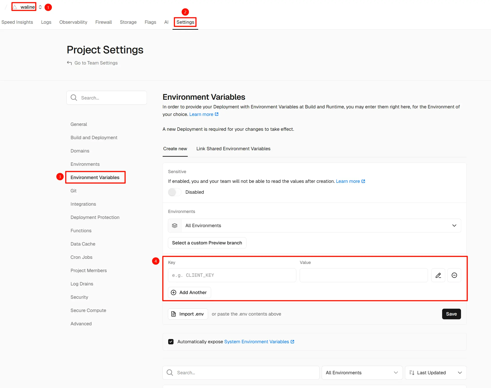
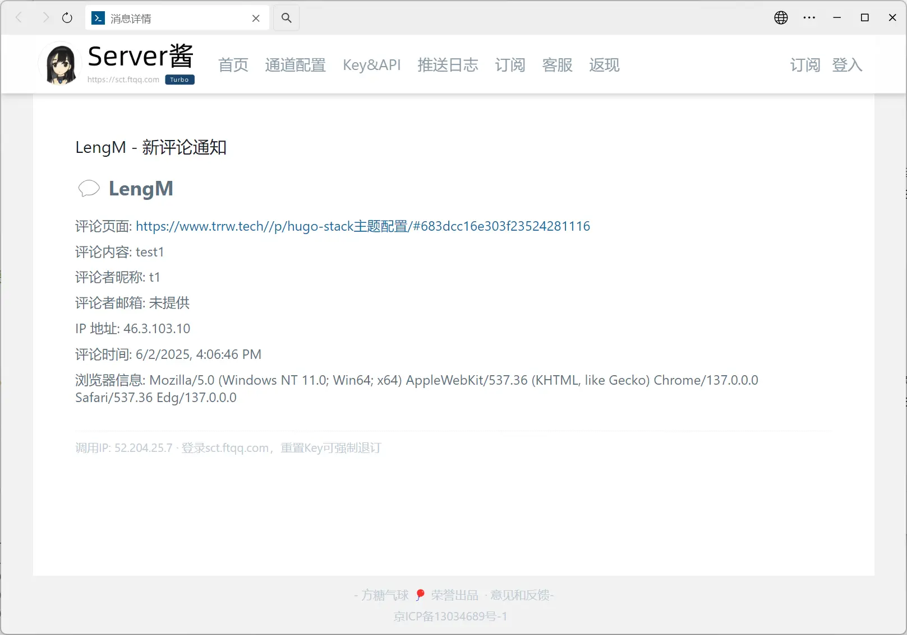

+++
title = 'Waline评论配置Server酱通知'
date = '2025-06-03T00:11:56+08:00'
tags = []
categories = []
image = 'cover.webp'
+++

## 添加环境变量
在你的 **Vercel** 中的 **Waline** 的 Project 中添加环境变量：



| 环境变量     | 描述                                                                                                                                                                                     |
| ------------ | ---------------------------------------------------------------------------------------------------------------------------------------------------------------------------------------- |
| SC_KEY       | Server 酱提供的 Token，**必填**                                                                                                                                                          |
| AUTHOR_EMAIL | 博主邮箱，用来区分发布的评论是否是博主本身发布的。如果是博主发布的则不进行提醒通知                                                                                                       |
| SITE_NAME    | 网站名称，用于在消息中显示                                                                                                                                                               |
| SITE_URL     | 网站地址，用于在消息中显示                                                                                                                                                               |
| SC_TEMPLATE  | Server酱 使用的通知模板，变量与具体格式可参见 [Waline文档](https://waline.js.org/guide/features/notification.html#%E9%80%9A%E7%9F%A5%E6%A8%A1%E6%9D%BF) 的通知模板。未配置则使用默认模板 |

## 添加推送代码
按理说这样设置之后就可以正常推送了，而且文档中就是这样写的，但实际是，即使设置了环境变量，也无法正常推送。  
此时打开你 **Waline** 对应的 Github 仓库，打开根目录下的 **index.cjs** 文件，在其中添加以下代码：
```javascript
const Application = require('@waline/vercel');

const FormData = require('form-data');
const fetch = require('node-fetch');

module.exports = Application({
    plugins: [],
    async postSave(comment) {
        // do what ever you want after comment saved
        console.log('New comment received:', comment);

        // 获取环境变量
        const { SC_KEY, SITE_NAME, SITE_URL, PUSH_PLUS_KEY } = process.env;

        // 准备数据
        const data = {
            self: comment,
            site: {
                name: SITE_NAME || 'Default Site Name',
                url: SITE_URL || 'https://default.site.url',
                postUrl: (SITE_URL || 'https://default.site.url') + comment.url + '#' + comment.objectId,
            },
        };

        const contentTemplate = `
💬 LengM
----------------------------

评论页面: ${data.site.postUrl}

评论内容: ${data.self.comment}

评论者昵称: ${data.self.nick}

评论者邮箱: ${data.self.mail || '未提供'}

IP 地址: ${data.self.ip || '未知'}

评论时间: ${new Date(data.self.createdAt).toLocaleString()}

浏览器信息: ${data.self.ua || '未知'}
`;

        const title = `LengM - 新评论通知`;

        let success = false;

        // Server酱通知
        if (SC_KEY) {
            const form = new FormData();
            form.append('text', title);
            form.append('desp', contentTemplate);

            try {
                const response = await fetch(`https://sctapi.ftqq.com/${SC_KEY}.send`, {
                    method: 'POST',
                    headers: form.getHeaders(),
                    body: form,
                });

                const result = await response.json();
                if (response.ok && result.code === 0) {
                    console.log('Server酱通知成功:', result);
                    success = true;
                } else {
                    console.error('Server酱通知失败:', result);
                }
            } catch (error) {
                console.error('Error sending Server酱 notification:', error.message);
            }
        } else {
            console.error('SC_KEY not defined in environment variables.');
        }

        // PushPlus通知
        if (PUSH_PLUS_KEY) {
            try {
                const pushplusResponse = await fetch('http://www.pushplus.plus/send/', {
                    method: 'POST',
                    headers: {
                        'Content-Type': 'application/x-www-form-urlencoded',
                    },
                    body: `token=${PUSH_PLUS_KEY}&title=${encodeURIComponent(title)}&content=${encodeURIComponent(contentTemplate)}&template=html`,
                });

                const pushplusResult = await pushplusResponse.json();
                if (pushplusResponse.ok && pushplusResult.code === 200) {
                    console.log('PushPlus通知成功:', pushplusResult);
                    success = true;
                } else {
                    console.error('PushPlus通知失败:', pushplusResult);
                }
            } catch (error) {
                console.error('Error sending PushPlus notification:', error.message);
            }
        } else {
            console.error('PUSH_PLUS_KEY not defined in environment variables.');
        }

        // 检查是否有任何通知成功
        if (!success) {
            console.error('两种通知方式均失败。');
            return false;
        }
    },
});
```
可以修改 **contentTemplate** 的值来自定义通知的内容。
将文件更新到 Github 之后 Vercel 会自动部署，等待部署完成就可以正常推送了。



## 附录
### 参考文献
1. [Waline 文档-评论通知](https://waline.js.org/guide/features/notification.html)
2. [walinejs/waline/issues/2828](https://github.com/walinejs/waline/issues/2828#issuecomment-2499552732)

### 文章封面
[松雀&觉姨](https://www.pixiv.net/artworks/127964621)
