+++
title = 'Windows11上配置C、C++环境'
date = '2023-09-06T21:53:01+08:00'
tags = ['Windows11','C','C++']
categories = ['教程']
image= 'pixiv-75321273.webp'
+++


## MinGW

> MinGW: A native Windows port of the GNU Compiler Collection (GCC), with freely distributable import libraries and header files for building native Windows applications; includes extensions to the MSVC runtime to support C99 functionality. All of MinGW's software will execute on the 64bit Windows platforms.

### 下载
[MinGW - Minimalist GNU for Windows](https://sourceforge.net/projects/mingw/)
<a href="https://sourceforge.net/projects/mingw/files/latest/download"><button>直接下载</button></a>

### 安装

1. 安装时选择好安装位置(不能有中文或空格)，其他默认即可。
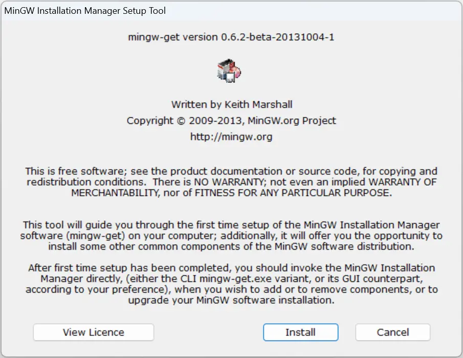
2. 安装完成后打开MinGW，勾选`mingw32-base`，`mingw32-gcc-g++`，分别是C/C++编译器。
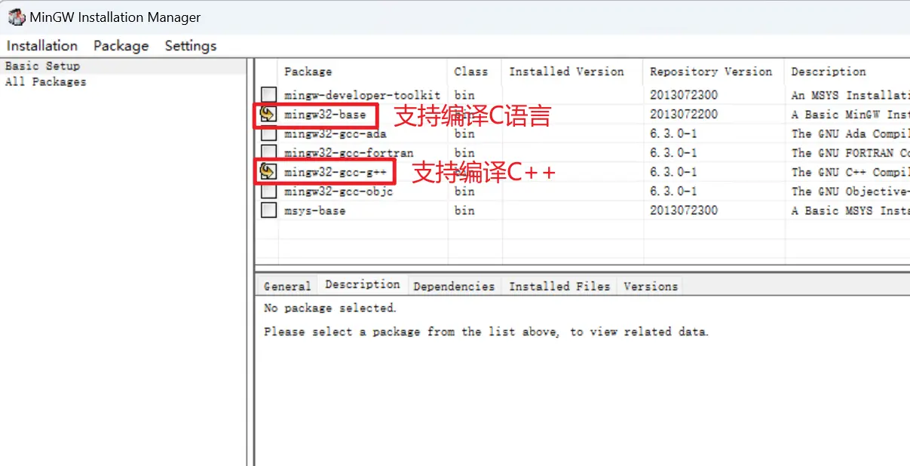
3. 点击`Installation` -> `Apply Changes`，在弹出窗口中点击`Apply`。
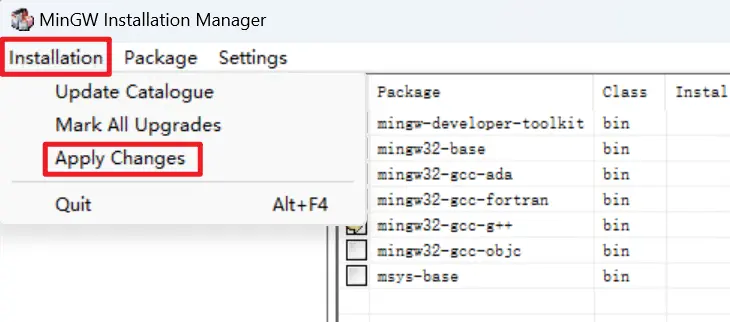
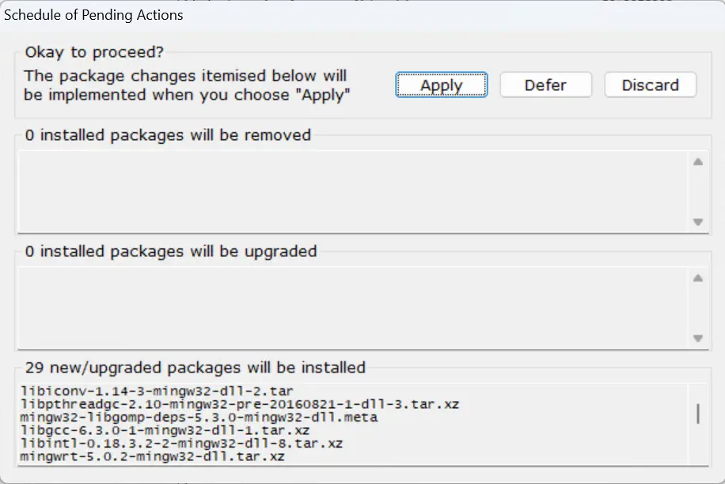
4. 将`MinGW`添加到系统环境变量
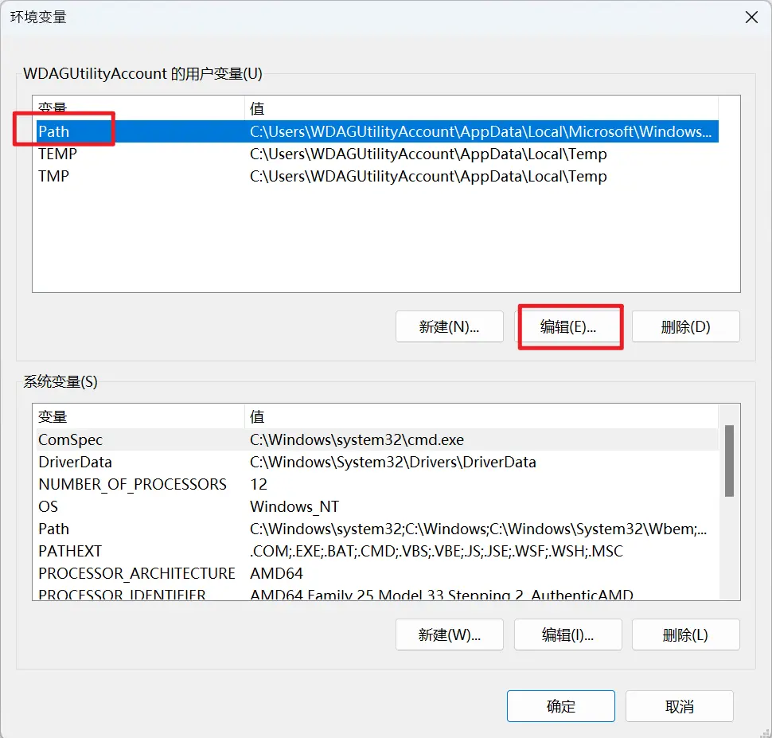
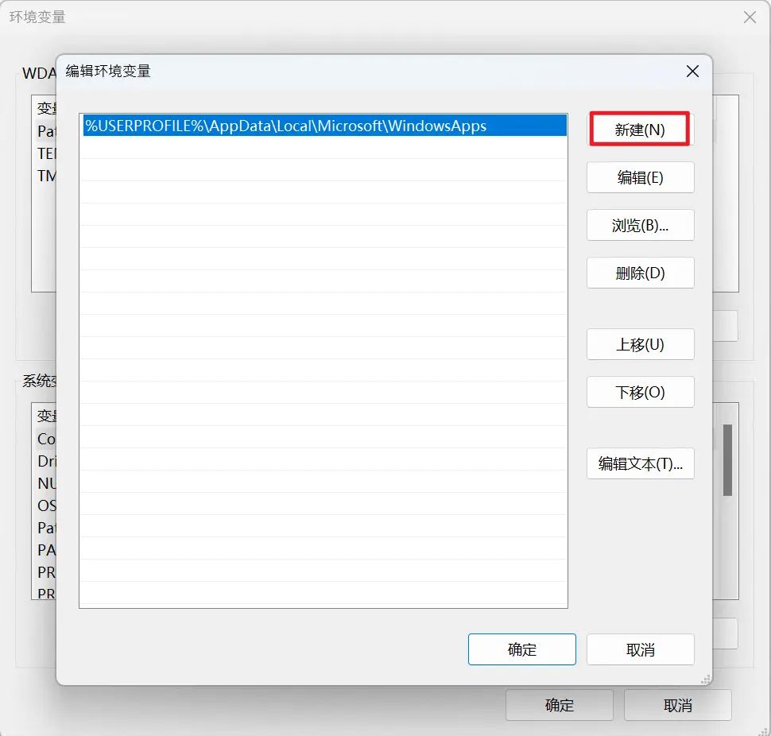
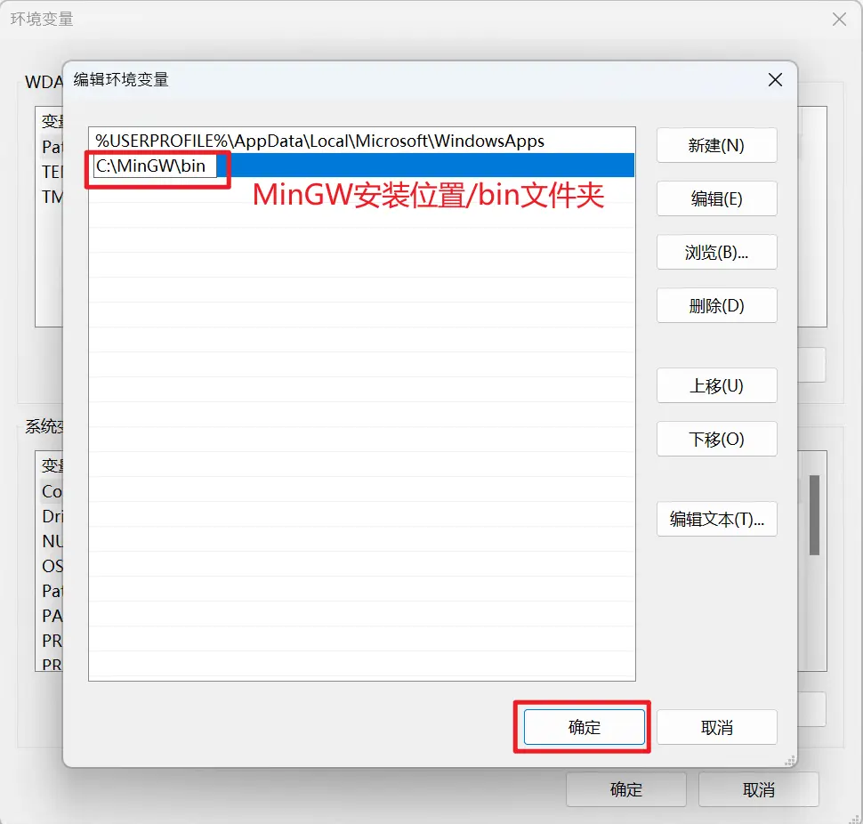
5. 在终端中输入`gcc -v`查看是否安装成功。
6. 进入MinGW安装位置`C:\MinGW\bin`，将`mingw32-make.exe`复制一个出来改成`make.exe`方便使用。

> 到这里你可以使用`gcc -o main main.c`来编译C程序。

---

## CMake

### 下载
[CMake下载地址](https://cmake.org/download/)，选择正确的平台，一般是x64。
<a href="https://github.com/Kitware/CMake/releases/download/v3.27.4/cmake-3.27.4-windows-x86_64.msi"><button>直接下载</button></a>
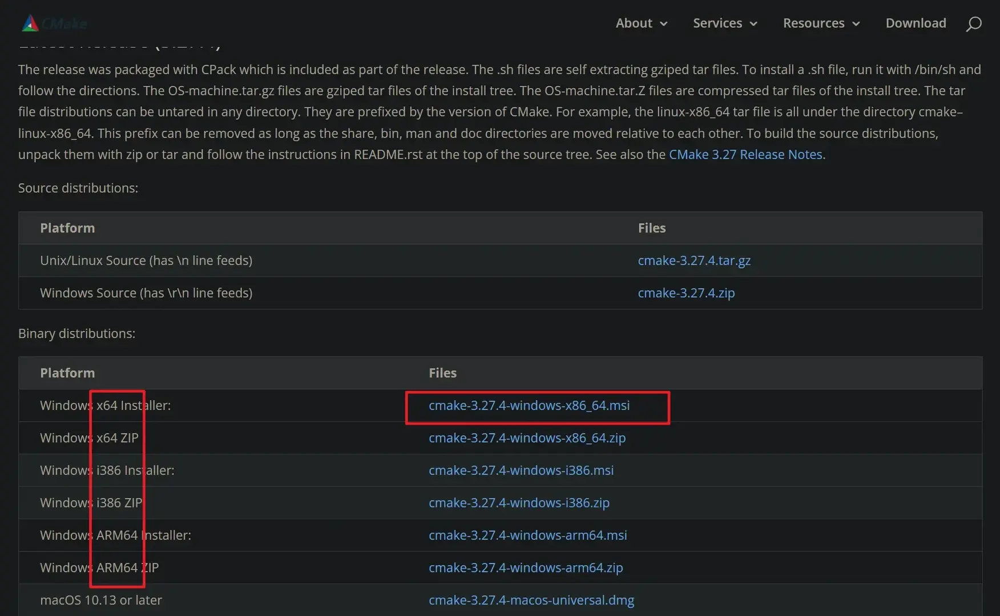

### 安装
1. 双击运行下载的`.msi`文件。
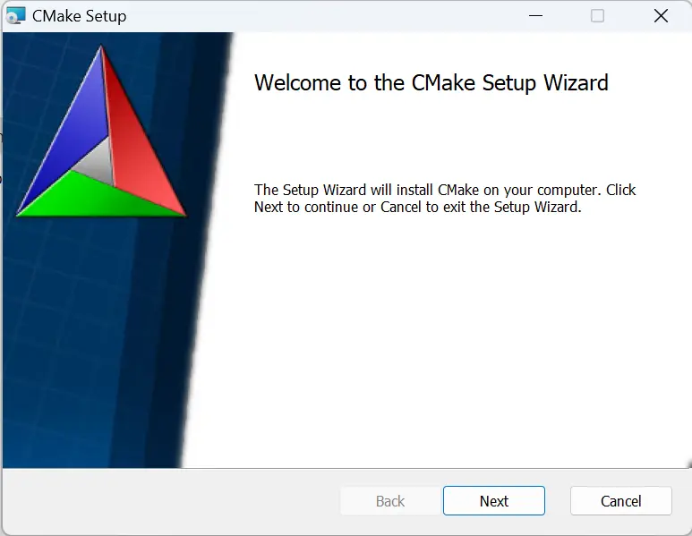
2. 选择第二个将`CMake`添加到系统环境变量，桌面快捷方式根据个人习惯选择。
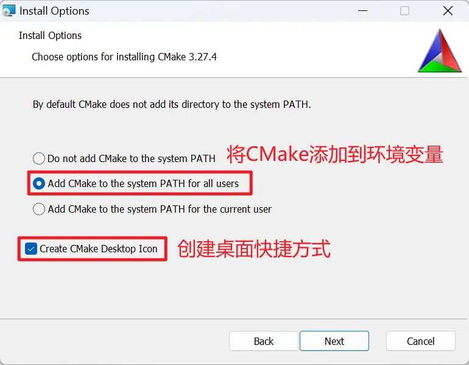
3. 选择安装位置。
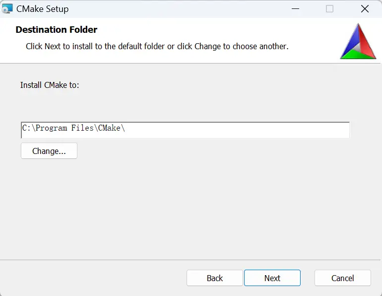
4. 在终端中输入`cmake --version`查看是否安装成功。

> <font color="red">系统环境变量修改后要重启终端才能生效</font>

---

## 使用CMake编译

1. 创建一个`test`文件夹。
```shell
mkdir test&&cd test
```
2. 在文件夹中新建`main.c`和`CMakeLists.txt`文件，并在其中分别写入以下内容。
```c
// main.c
#include <stdio.h>
int main()
{
    printf("Hello World!\n");
    return 0;
}
```
```cmake
# CMakeLists.txt
cmake_minimum_required(VERSION 3.27)
project(test)

# 这里的"C:/MinGW/bin"路径是你MinGW的路径
set(CMAKE_CXX_COMPILER "C:/MinGW/bin/g++.exe")

set(CMAKE_C_COMPILER "C:/MinGW/bin/gcc.exe")

add_executable(test main.c)
```
3. 在`test`文件夹下创建`build`文件夹，并用CMake编译。
```shell
mkdir build&&cd build
cmake .. -G "MinGW Makefiles"
make
```

---

## 错误

1. `The C compiler is not able to compile a simple test program.`

**运行：**
```shell
cmake .. -G "MinGW Makefiles"
```
**输出：**
```shell
PS D:\Trrrrw\文档\C\test\build> cmake .. -G "MinGW Makefiles"
-- The C compiler identification is GNU 6.3.0
-- The CXX compiler identification is GNU 6.3.0
-- Detecting C compiler ABI info
-- Detecting C compiler ABI info - failed
-- Check for working C compiler: D:/MinGW/bin/gcc.exe
-- Check for working C compiler: D:/MinGW/bin/gcc.exe - broken
CMake Error at D:/Trrrrw/应用/命令行工具/cmake/share/cmake-3.27/Modules/CMakeTestCCompiler.cmake:67 (message):
  The C compiler

    "D:/MinGW/bin/gcc.exe"

  is not able to compile a simple test program.

  It fails with the following output:

    Change Dir: 'D:/Trrrrw/文档/C/test/build/CMakeFiles/CMakeScratch/TryCompile-qihtzh'

    Run Build Command(s): D:/Trrrrw/应用/命令行工具/cmake/bin/cmake.exe -E env VERBOSE=1 D:/MinGW/bin/mingw32-make.exe -f Makefile cmTC_22fc3/fast
    D:/MinGW/bin/mingw32-make.exe  -f CMakeFiles\cmTC_22fc3.dir\build.make CMakeFiles/cmTC_22fc3.dir/build
    mingw32-make.exe[1]: Entering directory 'D:/Trrrrw/文档/C/test/build/CMakeFiles/CMakeScratch/TryCompile-qihtzh'
    系统找不到指定的路径。
    CMakeFiles\cmTC_22fc3.dir\build.make:76: recipe for target 'CMakeFiles/cmTC_22fc3.dir/testCCompiler.c.obj' failed
    mingw32-make.exe[1]: *** [CMakeFiles/cmTC_22fc3.dir/testCCompiler.c.obj] Error 1
    mingw32-make.exe[1]: Leaving directory 'D:/Trrrrw/文档/C/test/build/CMakeFiles/CMakeScratch/TryCompile-qihtzh'
    Makefile:126: recipe for target 'cmTC_22fc3/fast' failed
    mingw32-make.exe: *** [cmTC_22fc3/fast] Error 2


  CMake will not be able to correctly generate this project.
Call Stack (most recent call first):
  CMakeLists.txt:2 (project)


-- Configuring incomplete, errors occurred!
```
**解决：**
重新安装cmake，使用安装包安装，不要下载压缩包手动添加环境变量

2. `CMake Error: Target DependInfo.cmake file not found`

**运行：**
```shell
make
```
**输出：**
```shell
CMake Error: Target DependInfo.cmake file not found
make[2]: *** No rule to make target 'D:/Trrrrw//C/test/main.c', needed by 'CMakeFiles/test.dir/main.c.obj'.  Stop.
CMakeFiles/Makefile2:82: recipe for target 'CMakeFiles/test.dir/all' failed
make[1]: *** [CMakeFiles/test.dir/all] Error 2
Makefile:90: recipe for target 'all' failed
make: *** [all] Error 2
```
**解决：**
文件夹路径<font color="red">不能有中文</font>

---

参考文章：
[MinGW下载和安装教程](http://c.biancheng.net/view/8077.html)
