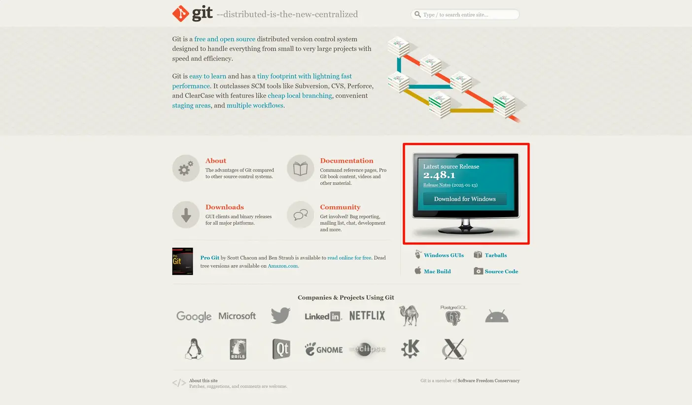

+++
date = '2025-03-14T19:26:51+08:00'
title = '使用Hugo+Stack搭建博客'
tags = ['Hugo','Stack','GitHub','Vercel']
categories = ['教程']
image = 'cover.webp'
+++


## 前言
这是一篇使用[Hugo](https://gohugo.io/)+[Stack](https://stack.jimmycai.com/)搭建博客的教程，主要是为了记录自己搭建博客的过程，方便以后使用。

## 安装 Hugo
> Hugo是由Go编写的快速现代静态网站生成器，旨在让网站创建变得有趣。 

在使用Hugo时常常需要使用到 [Git](https://git-scm.com/)、[Go](https://go.dev/)和[Dart Sass](https://hugo.opendocs.io/hugo-pipes/transpile-sass-to-css/#dart-sass)。
> 不过第三个Dart Sass没看懂怎么安装，不过也没有什么影响。

### 安装 Git
打开上面的[Git官网](https://git-scm.com/)之后，点击 **Download for Windows** 。

之后选择 **Standalone Installer** 下的 **64-bit Git for Windows Setup**.   
你会得到一个 **Git-x.xx.x-64-bit.exe** ，之后打开文件一路默认即可。

### 安装 Go
打开上面的[Go官网](https://go.dev/)之后，点击 **Download** 。


同样打开之后一路确认即可。

### 安装 Hugo
我这里使用的是 Win11，所以直接使用官方使用的安装方式：
```
winget install Hugo.Hugo.Extended
```
如果没有 **winget** ，可以去[GitHub下载](https://github.com/gohugoio/hugo/releases/latest) exe文件。  
在 **Assets** 里找到 **hugo_extended_x.xxx.x_windows-amd64.zip** 的文件下载，之后解压到文件夹中。
之后[将文件夹添加到环境变量](https://cn.bing.com/search?q=Windows%20%E6%B7%BB%E5%8A%A0%E7%8E%AF%E5%A2%83%E5%8F%98%E9%87%8F)中。

### 验证安装
打开终端，输入一下命令，如果出现以下内容，说明安装成功。
```powershell
git -v
#输出：git version 2.48.1.windows.1
go version
#输出：go version go1.24.1 windows/amd64
hugo version
#输出：hugo v0.145.0-666444f0a52132f9fec9f71cf25b441cc6a4f355+extended windows/amd64 BuildDate=2025-02-26T15:41:25Z VendorInfo=gohugoio
```
> Hugo的版本中一定要带有`+extended`。

## 创建网站
> 如果您是Windows用户：
> 
> - 不要使用命令提示符
> - 不要使用 Windows PowerShell
> - 请在 [PowerShell](https://learn.microsoft.com/en-us/powershell/scripting/install/installing-powershell-on-windows) 或 Linux 终端（如WSL或Git Bash）中运行这些命令
> 
> PowerShell 和 Windows PowerShell [是不同的应用程序](https://learn.microsoft.com/en-us/powershell/scripting/whats-new/differences-from-windows-powershell?view=powershell-7.3)。

上面是[Hugo官方文档](https://hugo.opendocs.io/getting-started/quick-start/#%e5%88%9b%e5%bb%ba%e7%bd%91%e7%ab%99)给出的提示，我这里使用的是Microsoft Store中的[PowerShell7](https://apps.microsoft.com/detail/9MZ1SNWT0N5D?hl=neutral&gl=CN&ocid=pdpshare)。

运行以下命令，运行时将其中的`site-folder`替换为你想要的文件夹名称。
```powershell
hugo new site site-folder
cd site-folder
git init
```

## 安装 Stack 主题
紧接着上面的命令，在`site-folder`路径下运行以下命令：
```powershell
hugo mod init github.com/你的GitHub用户名/你用于存放网站的仓库名
```
然后打开 [Stack主题的模板仓库](https://github.com/CaiJimmy/hugo-theme-stack-starter)，
克隆这个仓库或者其他什么办法，将其中的`config`文件夹复制到你的`site-folder`中，然后默认生成的那个`hugo.toml`就可以删除了。

确定`config`文件夹中的`_default`文件夹下的`config.toml`文件存在之后，运行以下命令：
```powershell
hugo server
```
之后会出现以下内容：
```powershell
Web Server is available at http://localhost:xxxx/ (bind address 127.0.0.1)
```
然后在浏览器中打开这个`http://localhost:xxxx/`，就可以看到你的网站了。你可以在这里实时看到你对网站的修改。(有些操作不会实时刷新，还是需要重新运行`hugo server`才能看到)
> 但是这个端口每次启动都会变，如果想要端口不变的话可以在命令后面加上`-p 端口号`，
> 如果想要局域网内的设备也可以访问的话可以在命令后面加上`--bind 0.0.0.0`。
> ```powershell
> hugo server --bind 0.0.0.0 -p 8080
> ```
至于配置主题，回头单独开一个教程吧。~~有一说一，官网的文档是有点简陋的~~

## 编写博客
### 文件结构
文章的文件夹是放在`content/post`文件夹下的，文件结构如下：
```
content
└── post
    └── my-first-post
        ├── index.md
        ├── image1.png
        └── image2.png
```
可以使用一下命令创建一个新的文章：
```powershell
hugo new post/my-first-post/index.md
```

### Markdown
打开使用上面命令生成的`index.md`文件，会发现最上方自动生成了一个使用`+++`分隔的内容，这个内容就是 Front Matter（前置参数）。
> `+++`围起来的内容格式是TOML，`---`围起来的内容格式是YAML。  
> 这里使用TOML为例。

```toml
+++
date = '' # 文章创建时间，这个会自动生成
draft = true # 文章是否为草稿，true为草稿，此时你在网页中是看不到这篇文章的，需要将其设为false或者删除这个参数
title = '' # 文章标题
description = '' # 文章简介
image = '' # 文章封面图片
comments = true # 文章是否允许评论，true为允许，false为不允许
license = '' # 页面的许可证。如果设置为false，许可证部分将被隐。
math = false # 启用/禁用 KaTeX 渲染
toc = false # 显示/隐藏页面的目录
style = '' # Additional CSS styles for taxonomy term badge that appears in article page.
keywords = [] # 文章的关键字，用于SEO
readingTime = true # 显示/隐藏阅读时间
+++
```

## 部署
### GitHub
#### 新建 GitHub 仓库
打开 https://github.com/new ，在 **Repository name** 里填写你在 安装 Stack 主题 中使用的仓库名，然后点击 **Create repository** 。

#### 将文件上传到 GitHub
打开终端，在`site-folder`路径下运行以下命令：
```powershell
git add .
git commit -m "Initial commit"
git branch -M main
git remote add origin https://github.com/你的GitHub用户名/你用于存放网站的仓库名.git
git push -u origin main
```
之后每次想要更新网站时，只需要运行以下命令：
```powershell
git add .
git commit -m "更新内容，可修改"
git push origin main
```

### Vercel
#### 配置 Vercel 项目
首先打开 https://vercel.com/，注册或登录。进入 **Overview** 界面，点击右上角的 **Add New...** 里的 **Project** 。

在左侧的 **Import Git Repository** 中登录 **GitHub**，选择刚刚创建的仓库，然后点击 **Import**。


之后在 **Framework Preset** 中选择 **Hugo**，然后点击下方的 **Build and Output Settings**，按照下图填写，
然后点击 **Deploy**，等待一段时间后，就可以进入项目页面了。
```
# Build Command
hugo --gc --minify
# Install Command
yum install -y golang
```


等待 **Status** 变为 **Ready** 后，就可以点击上面 **Domains** 下的链接打开你的网站了。


#### 自定义域名
可以看到，默认的域名是 `xxxx.vercel.app`，这个域名不仅不美观，更重要的是，他在国内基本处于无法访问的状态。


点击项目名上方的 **Settings**，然后点击 **Domains** -> **Add**，在 **Add Domain** 中输入你的域名。


我这里使用的域名解析是 **Cloudflare**，在添加域名后会自动跳转到 **Cloudflare** 的页面，点击同意后会自动在 DNS 解析中添加对应的解析。  
而自动添加的解析的目标值依旧是不方便访问的`cname.vercel-dns.com`，这里手动将其修改成`cname-china.vercel-dns.com`。


等待一段时间后就可以使用自己的域名访问啦！

## 附录
### 参考文献
1. [HUGO中文文档](https://hugo.opendocs.io/)
2. [Stack主题文档](https://stack.jimmycai.com/)
3. [失迹の博客 | 使用 Hugo + Stack 简单搭建一个博客](https://blog.reincarnatey.net/2023/build-hugo-blog-with-stack-mod/)
4. [rizkidoank | Deploy Hugo to Vercel](https://www.rizkidoank.com/2024/02/26/deploy-hugo-to-vercel/)
