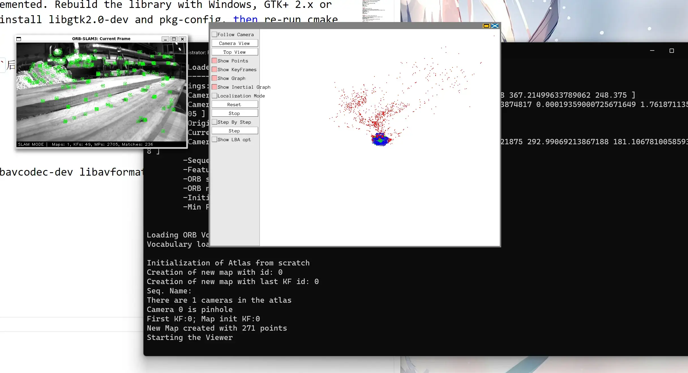

+++
title = '在WSL2中运行ORB SLAM3'
date = '2022-10-06T21:09:26+08:00'
tags = ['ORB-SLAM3','WSL2','Ubuntu']
categories = ['教程']
image= 'ORB-SLAM3-cover.webp'
+++


仓库链接
[UZ-SLAMLab/ORB_SLAM3](https://github.com/UZ-SLAMLab/ORB_SLAM3)

## 系统
> 我前面弄了Apollo所以想再整个新系统来弄SLAM，也可以直接在原系统中进行。
1. 在[wsl2-distro-manager](https://github.com/bostrot/wsl2-distro-manager)的release中下载最新版的压缩包。
2. 打开就可以复制已有的WSL。

---

## 依赖
### Pangolin
[Pangolin-Github](https://github.com/stevenlovegrove/Pangolin)
```bash
git clone https://github.com/stevenlovegrove/Pangolin
cd Pangolin/scripts/
rm -rf vcpkg/
git clone https://github.com/microsoft/vcpkg
cd ..
./scripts/install_prerequisites.sh --dry-run recommended
mkdir build && cd build
cmake ..
cmake --build .
sudo make install
```

### OpenCV
[opencv.org](https://opencv.org/)
1. 安装依赖
    ```bash
    sudo apt install build-essential libgtk2.0-dev libavcodec-dev libavformat-dev libjpeg-dev libswscale-dev libtiff5-dev
    sudo apt install libgtk2.0-dev
    sudo apt install pkg-config
    ```
2. 安装OpenCV
    ```bash
    sudo apt update && sudo apt install g++ unzip wget cmake
    wget -O opencv.zip https://github.com/opencv/opencv/archive/refs/tags/4.4.0.zip
    unzip opencv.zip
    cd opencv-4.4.0/
    mkdir build && cd build
    cmake ..
    cmake --build .
    sudo make install
    ```
> 安装好依赖的话在[5.3](/在WSL2中运行ORB-SLAM3/#WSL2)中应该就不会报错

### Eigen3
[eigen.tuxfamily.org](https://eigen.tuxfamily.org/)
```bash
wget https://gitlab.com/libeigen/eigen/-/archive/3.1.1/eigen-3.1.1.zip
unzip eigen-3.1.1.zip && cd eigen-3.1.1
mkdir build && cd build
cmake ..
sudo make install
sudo cp -r /usr/local/include/eigen3/Eigen /usr/local/include
```
> 不知道为什么这个不用`cmake --build .`

---

## 安装
Clone the repository:
```bash
git clone https://github.com/UZ-SLAMLab/ORB_SLAM3.git ORB_SLAM3
```
```bash
cd ORB_SLAM3
chmod +x build.sh
./build.sh
```

**报错1**
```bash
/home/trrrrw/orb-slam3/ORB_SLAM3/Thirdparty/DBoW2/DBoW2/BowVector.h:17:10: fatal error: boost/serialization/serialization.hpp: No such file or directory
 #include <boost/serialization/serialization.hpp>
```
```bash
sudo apt install libboost-dev
```

**报错2**
```bash
/home/trrrrw/orb-slam3/ORB_SLAM3/src/System.cc:26:10: fatal error: openssl/md5.h: No such file or directory
 #include <openssl/md5.h>
```
```bash
sudo apt install libssl-dev
```

**报错3**
```bash
/usr/bin/ld: cannot find -lboost_serialization
```
安装boost
```bash
sudo apt install libboost-all-dev
```

---

## 测试数据集
1. 下载数据集
https://projects.asl.ethz.ch/datasets/doku.php?id=kmavvisualinertialdatasets#downloads
下载ASL格式
放在最外面新建文件夹 `Examples`
2. 解压出`mav0`文件夹
3. 在`ORB_SLAM3`下新建文件夹`dataset/MH01`，将`mav0`文件夹放在这
    ```bash
    mkdir dataset && cd dataset
    mkdir MH01 && cd MH01
    ## 把mav0文件夹复制到MH01里就行
    cp -r ../../../Examples/mav0/ ./
    ```
4. 运行
    ```bash
    cd ../../Examples
    ./Monocular/mono_euroc ../Vocabulary/ORBvoc.txt ./Monocular/EuRoC.yaml ../dataset/MH01 ./Monocular/EuRoC_TimeStamps/MH01.txt
    ```
    > 这样应该是没有窗口的
    > 在 Examples/Monocular/mono_euroc.cc 第 83 行附近，将函数的最后一个参数更改为 true ORB_SLAM3::System SLAM(argv[1],argv[2],ORB_SLAM3::System::MONOCULAR, **true**); 默认情况下为 **false**，改为**true**
    > *用WSL这样还是没有窗口*🤷‍♂️

---

## WSL2
1. 安装xfce4
    ```bash
    sudo apt install xfce4
    ```
2. 重新编译会报错（如果[2.2.1](/p/在WSL2中运行ORB-SLAM3/#OpenCV)没安装依赖的话）
    ```bash
      what():  OpenCV(4.4.0) /home/trrrrw/orb-slam3/opencv-4.4.0/modules/highgui/src/window.cpp:634: error: (-2:Unspecified error) The function is not implemented. Rebuild the library with Windows, GTK+ 2.x or Cocoa support. If you are on Ubuntu or Debian, install libgtk2.0-dev and pkg-config, then re-run cmake or configure script in function 'cvNamedWindow'
    ```
    1. 删除OpenCV后安装`libgtk2.0-dev` and `pkg-config`后重新编译安装
    ```bash
    cd opencv-4.4.0/build
    sudo make uninstall
    ```
    2. 安装依赖
    ```bash
    sudo apt install build-essential libgtk2.0-dev libavcodec-dev libavformat-dev libjpeg-dev libswscale-dev libtiff5-dev
    sudo apt install libgtk2.0-dev
    sudo apt install pkg-config
    ```
    3. 编译安装
    ```bash
    cd build
    cmake ..
    cmake --build .
    sudo make install
    ```
3. 再执行[4.4](/p/在WSL2中运行ORB-SLAM3/#测试数据集)
   成功👍
   
