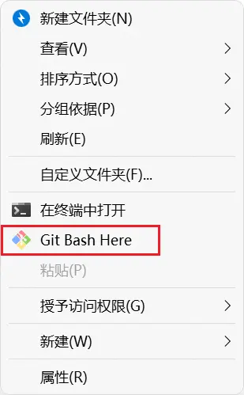
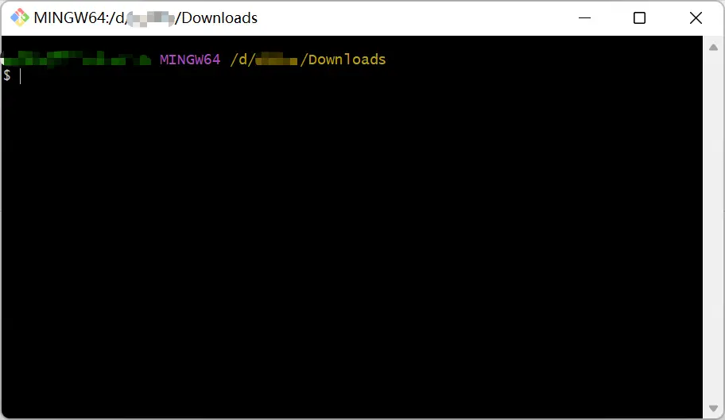

+++
title = '基于Hexo搭建blog网站'
date = '2022-07-04T22:24:42+08:00'
tags = ['Hexo','GitHub','Node.js','Git']
categories = ['建站记录']
image= 'Hexo-cover.webp'
+++


## Node.js
### 介绍
* [百度百科](https://baike.baidu.com/item/Node.js/7567977)
* [菜鸟教程](https://www.runoob.com/nodejs/nodejs-tutorial.html)

### 下载
[官网](https://nodejs.org/en/)

### 安装
[CSDN](https://blog.csdn.net/chanyeolchichi/article/details/121348541)
> 只需要完成第一步即可，第二步`修改全局模块路径和缓存路径`可以不做，npm包一般不会很大。


## Git
### 下载
[官网](https://git-scm.com/)

### 使用
安装完成后右键菜单会有这个





### 常用命令
1. `cd "路径"`
   > 打开路径
2. `git clone 链接`
   > 克隆仓库，链接为仓库链接。克隆下来的位置是上面那个命令打开的路径。


## 新建GitHub仓库
https://github.com/new
填写仓库名`blog`，其他默认。


## 安装Hexo
```bash
npm install -g hexo-cli
```
> 如果之后打开项目后不能用hexo命令可以再重新安装hexo


## 新建站点
```bash
hexo init <folder>
cd <folder>
npm install
```
> 要把`<folder>`改为自己的文件夹名，`<>`也要去掉

新建完成后指定文件夹的目录：
```
.
├── _config.yml
├── package.json
├── scaffolds
├── source
|   ├── _drafts
|   └── _posts
└── themes
```
**_config.yml**中的一些参数

|参数|描述|
|---|---|
|title|网站标题|
|subtitle|网站副标题|
|description|网站描述|
|keywords|网站的关键词。支持多个关键词。|
|author|您的名字|
|language|网站使用的语言。对于简体中文用户来说，使用不同的主题可能需要设置成不同的值，请参考你的主题的文档自行设置，常见的有 zh-Hans和 zh-CN。|
|timezone|网站时区。Hexo 默认使用您电脑的时区。请参考 时区列表 进行设置，如 America/New_York, Japan, 和 UTC 。一般的，对于中国大陆地区可以使用 Asia/Shanghai。|
> * 更多详细说明移步[官方文档](https://hexo.io/zh-cn/docs/configuration)
> * ⭐最主要的是url和root，如果不自定义域名的话，url为`https://<username>.github.io/<repositories>/`，root为`/<repositories>/`。如果设置不正确的话可能会导致网页没有css样式。
> * 参数名后的冒号后面要有一个空格


## 安装主题
> 一般主题都会有使用教程，这里只展示了使用主题文件安装的过程。
1. 从[主题站](https://hexo.io/themes/)找到自己喜欢的主题，点击标题进入对应GitHub仓库下载
2. 将主题文件放到一个单独文件夹`<ThemeFolder>`，并将改文件夹放在`themes`文件夹里
3. 在站点的_config.yml文件中theme的内容更改为`<ThemeFolder>`即可
 - 一个主题可能会有以下的结构：
```
.
├── _config.yml
├── languages
├── layout
├── scripts
└── source
```
**_config.yml**
主题的配置文件。和 Hexo 配置文件不是同一个文件，要注意区分。
> 如需更换主题，只需要将新主题的文件夹放到正确位置，再将站点的`_config.yml`文件中`theme`的内容更改为新的主题名即可


## 生成静态文件
```bash
hexo g   #hexo generate的缩写
```
> 网页需要的文件都在public文件夹下，将该文件夹下文件上传到GitHub仓库即可。


## 启动服务
```bash
hexo s   #hexo server的缩写
```
> 用这个可以先在本地预览你的网页  
> 如果不能用的话先安装，`--save`是把npm包安装在这个项目中并记录在`package.json`中
```bash
npm install hexo-server --save
```


## 新建文章
```bash
hexo new [layout] <title>
```
> 同样`[]`和`<>`也要去掉

|布局（Layout）|路径|描述|
|---|---|---|
|post|source/_posts|文章|
|page|source|页面|
|draft|source/_drafts|草稿|

## 部署到GitHub
打开网站的`_config.yml`
在文件底部找到以下内容并补全：
```yml
deploy:
  type: git
  repo: https://github.com/Trrrrw/blog ## 你的仓库链接
  branch: main
```
然后在blog文件夹中打开终端输入命令`npm install hexo-deployer-git --save`安装部署插件。
之后输入命令：
```bash
hexo clean  #清除已生成的静态文件
hexo g      #hexo generate 生成静态文件
hexo d      #hexo deploy 生成静态文件并部署到仓库
```
> 如果在部署的时候出现 `Failed to connect to github.com port`之类的错误，在终端中执行`git config --global --unset http.proxy`和`git config --global --unset https.proxy`应该就行了。
> 完成之后要去GitHub仓库里找到Settings -> Pages -> Build and deployment -> Branch，设置成`main`分支，路径为`/(root)`。点`save`保存之后就能在https://username.github.io/repo/ 里看到你的网页。

## 自定义域名
### 购买域名
例：`example.com`

### 域名解析
1. 在电脑上执行
```
ping username.github.io
```
得到
```
正在 Ping username.github.io [IP地址] 具有 32 字节的数据:
...
```
记住上面的**IP地址**

2. 在购买的域名**控制台**找到`域名列表-域名解析`
3. 添加解析

|主机记录|记录类型|解析路线|记录值|TTL|
|---|---|---|---|---|
|@|AAAA|默认|IPV6地址|10 分钟|
|@|A|默认|IPV4地址|10 分钟|
|@|CNAME|默认|username.github.io|10 分钟|
|www|CNAME|默认|username.github.io|10 分钟|
> 前两个行用**有一个即可**，但好像都没什么用。还会和第三行冲突。
> 可以**只有后面两行**，第四行的`www`可以换成自己喜欢的、符合规范的前缀，可以设成`blog`来说明这个网站是一个blog网站。也可以只有第三行，这样就是一个裸域名比较好记忆。
> 如果修改了的话下面两项设置要把`www`改成对应的前缀或者删除。


### 绑定GitHub Page
1. 在GitHub仓库中点击`Settings->Pages`
2. 在Custom domain下填写`www.example.com`
3. 点`Save`保存
4. 等待GitHub检查完DNS勾选下面的`Enforce HTTPS`

### 修改Hexo的_config.yml
在Hexo的`_config.yml`中修改`url`和`root`
```
url: https://www.example.com
root: /
```
再重新部署一次即可

---

参考文章：
[官方文档](https://hexo.io/zh-cn/docs/)
[Markdown教程](https://markdown.com.cn/)
