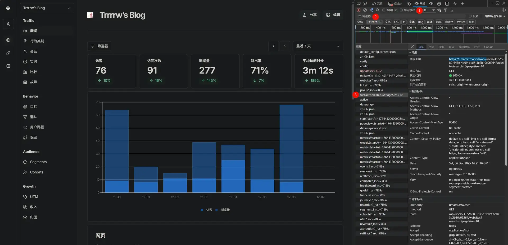

+++
title = '通过Umami实现访客数、浏览量'
date = '2025-12-06T23:56:40+08:00'
tags = ['Umami','Hugo','Stack']
categories = ['建站记录']
image = 'cover.webp'
draft = true
+++

## 获取 Token
Umami 是有 API 的 [(API Reference)](https://umami.is/docs/api)  
但是这玩意需要账号密码才能访问，不过账号密码也是用来拿 Token 的，所以我们直接拿 Token 就行了  
这个 Token 无论如何都要在前端使用的，所以直接拿得了🫠  
回头看看写个后端把这玩意封装一下

打开 Umami 后台，打开一个网页概览，随便找一个 `/api/` 结尾的请求



在请求标头里找到 `Authorization` 和 `Cookie` copy下来之后替换掉后面代码中的 `:authorization` 和 `:cookie`


## 浏览量、访客、访问次数
文档：[GET /api/websites/:websiteId/stats](https://umami.is/docs/api/website-stats#get-apiwebsiteswebsiteidstats)  
打开 `params.toml`，在 `[footer]` 的 `customText` 中添加以下内容
```html
<span id="visit-info"></span>
```

`layouts\partials\footer\custom.html`
```html
<!-- 浏览量、访客、访问次数 -->
<script>
    (async () => {
        const spanElement = document.getElementById('visit-info')
        let pageviews = 0
        let visitors = 0
        let visits = 0
        const endOfDay = new Date()
        endOfDay.setHours(23, 59, 59, 999)
        const endAt = endOfDay.getTime()
        const headers = {
            'authorization': ':authorization',
            'cookie': ':cookie'
        }
        try {
            const res = await fetch(`https://umami.trrw.tech/api/websites/:websiteId/stats?startAt=:startAt&endAt=${endAt}&unit=day&timezone=Asia%2FShanghai`, { headers: headers })
            const viewsData = await res.json()
            pageviews = viewsData.pageviews || 0
            visitors = viewsData.visitors || 0
            visits = viewsData.visits || 0
        } finally {
            spanElement.innerText = `浏览量${pageviews} · 访客${visitors} · 访问次数${visits}`
        }
    })()
</script>
```

获取 `:websiteId`


`:startAt` 可以在后台把时间调成 `所有时间段` 后找到这个stats请求来获得


最终效果  


## 文章浏览量
文档：[GET /api/websites/:websiteId/metrics/expanded](https://umami.is/docs/api/website-stats#get-apiwebsiteswebsiteidmetricsexpanded)

`layouts\partials\article\components\details.html`
```html
<div class="article-details">
    {{ if .Params.categories }}
    <header class="article-category">
        {{ range (.GetTerms "categories") }}
            <a href="{{ .RelPermalink }}" {{ with .Params.style }}style="background-color: {{ .background }}; color: {{ .color }};"{{ end }}>
                {{ .LinkTitle }}
            </a>
        {{ end }}
    </header>
    {{ end }}

    <div class="article-title-wrapper">
        <h2 class="article-title">
            <a href="{{ .RelPermalink }}">
                {{- .Title -}}
            </a>
        </h2>
    
        {{ with .Params.description }}
        <h3 class="article-subtitle">
            {{ . }}
        </h3>
        {{ end }}
    </div>

    {{ $showReadingTime := .Params.readingTime | default (.Site.Params.article.readingTime) }}
    {{ $showDate := not .Date.IsZero }}
    {{ $showFooter := or $showDate $showReadingTime }}
    {{ if $showFooter }}
    <footer class="article-time">
        {{ if $showDate }}
            <div>
                {{ partial "helper/icon" "date" }}
                <time class="article-time--published" datetime='{{ .Date.Format "2006-01-02T15:04:05Z07:00" }}'>
                    {{- .Date | time.Format (or .Site.Params.dateFormat.published "Jan 02, 2006") -}}
                </time>
            </div>
        {{ end }}

        {{ if $showReadingTime }}
            <div>
                {{ partial "helper/icon" "clock" }}
                <time class="article-time--reading">
                    {{ T "article.readingTime" .ReadingTime }}
                </time>
            </div>
        {{ end }}

        <!-- 这里是新增的，其余都是主题原本的功能 -->
        <!-- 浏览量 -->
        <div>
            {{ partial "helper/icon" "read" }}
            <time class="article-analysic" data-path="{{ .RelPermalink }}">
                0 阅读
            </time>
        </div>
        <!-- ⬆️⬆️⬆️ -->
    </footer>
    {{ end }}

    {{ if .IsTranslated }}
        <footer class="article-translations">
            {{ partial "helper/icon" "language" }}
            <div>
                {{ range .Translations }}
                    <a href="{{ .Permalink }}" class="link">{{ .Language.LanguageName }}</a>
                {{ end }}
            </div>
        </footer>
    {{ end }}
</div>
```
这里 `{{ partial "helper/icon" "read" }}` 是对应的 `assets/icons` 下的svg，这里就是 `assets/icons/read.svg`  
这里贴一下svg代码，省的找了
```svg
<svg xmlns="http://www.w3.org/2000/svg" width="24" height="24" viewBox="0 0 24 24" fill="none"
    stroke="currentColor" stroke-width="2" stroke-linecap="round" stroke-linejoin="round"
    class="icon icon-tabler icons-tabler-outline icon-tabler-eye">
    <path stroke="none" d="M0 0h24v24H0z" fill="none" />
    <path d="M2 12s3 -7 10 -7s10 7 10 7s-3 7 -10 7s-10 -7 -10 -7" />
    <circle cx="12" cy="12" r="2" />
</svg>
```

`layouts\partials\footer\custom.html`
```html
<!-- 文章浏览量 -->
<script>
    (async () => {
        const els = document.querySelectorAll('.article-analysic')
        console.log(els)
        if (!els.length) return

        const endOfDay = new Date()
        endOfDay.setHours(23, 59, 59, 999)
        const endAt = endOfDay.getTime()
        const headers = {
            'authorization': ':authorization',
            'cookie': ':cookie'
        }
        for (const el of els) {
            const search = el.dataset.path || '/'
            console.log('search', decodeURIComponent(search))
            let pageviews = 0
            try {
                const res = await fetch(`https://umami.trrw.tech/api/websites/:websiteId/metrics/expanded?startAt=:startAt&endAt=${endAt}&unit=day&timezone=Asia%2FShanghai&search=${search}&type=path`, { headers: headers })
                const data = await res.json()
                console.log('umami data', data)
                if (Array.isArray(data) && data.length > 0)
                    pageviews = data[0].pageviews || 0
            } finally {
                el.textContent = `${pageviews} 阅读`
            }
        }
    })()
</script>
```

最终效果  


## 附录
### 参考文献
1. [Umami API Reference](https://umami.is/docs/api)

### 文章封面
[文章封面](https://www.pixiv.net/artworks/136521116)
